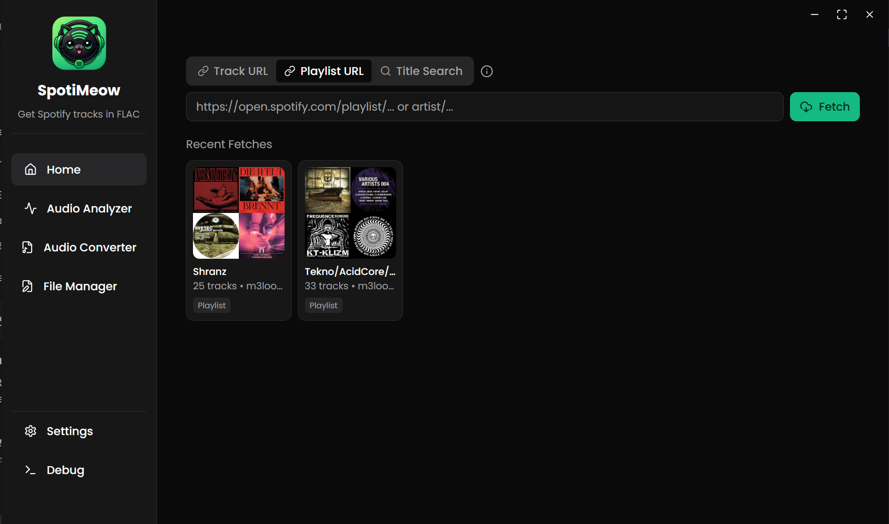

<div align="center">

# 🎵 SpotiMeow 🐾


### *Desktop Music Application - Portfolio Project*

**Modern cross-platform desktop application built with Go, Wails, React & TypeScript**

[](LICENSE)
[](https://golang.org)
[](https://reactjs.org)
[](https://typescriptlang.org)
[](https://wails.io)


</div>

---

## 🚀 **Project Overview**

**SpotiMeow** is a sophisticated desktop application that demonstrates modern cross-platform development using cutting-edge technologies. This project showcases advanced integration between multiple streaming platform APIs, real-time audio processing, and a sleek modern user interface.

---

## 🎵 **What SpotiMeow Does**

**SpotiMeow** is a comprehensive music application that brings together multiple streaming platforms in one elegant desktop interface. Here's what makes it special:

### 🔍 **Music Discovery & Search**
- **Smart Search** - Find tracks, albums, playlists, and artists across platforms
- **URL Processing** - Paste Spotify, Tidal, Qobuz, or Amazon Music URLs directly
- **Cross-Platform Matching** - Automatically finds the same content across different services

### 📥 **Multi-Source Track Access**
- **Spotify Integration** - Browse and search your favorite Spotify content
- **Tidal Access** - High-quality lossless audio from Tidal
- **Qobuz Support** - Premium audiophile-quality tracks
- **Amazon Music** - Alternative source for comprehensive coverage

### 🎛️ **Advanced Audio Processing**
- **Format Conversion** - Convert between MP3, FLAC, WAV, and more
- **Quality Options** - Choose from various bitrates and quality levels
- **Batch Processing** - Handle multiple tracks simultaneously
- **Metadata Management** - Automatic tagging with complete track information

### 📊 **Real-Time Audio Analysis**
- **Spectrum Analyzer** - Visual representation of audio frequencies
- **Audio Visualization** - Real-time waveform and spectrum displays
- **Quality Metrics** - Analyze audio quality and characteristics
- **Technical Details** - View codec, bitrate, and format information

### 📂 **Intelligent Organization**
- **Smart File Management** - Organize music by artist, album, genre
- **Custom Folder Structure** - Configure how files are saved and named
- **Metadata Embedding** - Complete ID3 tags, album art, and track info
- **Library Management** - Keep track of your downloaded content

### 🖥️ **Modern Interface**
- **Tabbed Interface** - Separate tabs for different functions
- **Input Tab** - Search and URL processing
- **Output Tab** - Download management and file organization  
- **Analyzer Tab** - Audio analysis and visualization tools
- **Settings Tab** - Customize app behavior and preferences

---

## 🎯 **Core Functionality**
- **Multi-platform music discovery** via API integrations
- **High-quality audio processing** and format conversion
- **Real-time spectrum analysis** and visualization
- **Intelligent metadata extraction** and organization
- **Cross-platform desktop deployment**

---

## 🛠️ **Technical Architecture**

<div align="center">

### **Tech Stack Highlights**

</div>

| **Category** | **Technology** | **Purpose** |
|:------------:|:-------------:|:------------|
| **Backend** | Go 1.19+ | Core application logic & system integration |
| **Framework** | Wails v2 | Desktop app framework bridging Go & Web |
| **Frontend** | React 18+ | Modern component-based user interface |
| **Language** | TypeScript 5+ | Type-safe frontend development |
| **Styling** | Tailwind CSS | Utility-first responsive design |
| **Build Tool** | Vite | Fast development server & optimized builds |
| **Audio** | FFmpeg | Audio processing & format conversion |
| **UI Components** | Radix UI | Accessible, unstyled UI primitives |

---

## 🏗️ **Project Structure**

```
SpotiMeow/
├── backend/                    # Go backend services
│   ├── amazon.go              # Amazon Music API integration
│   ├── tidal.go               # Tidal API integration  
│   ├── qobuz.go               # Qobuz API integration
│   ├── spotify_metadata.go   # Spotify metadata service
│   ├── analysis.go            # Audio analysis engine
│   ├── spectrum.go            # Spectrum visualization
│   ├── ffmpeg.go              # Audio processing pipeline
│   └── metadata.go            # Metadata extraction & tagging
├── frontend/                  # React TypeScript frontend
│   ├── src/
│   │   ├── components/        # UI components
│   │   ├── hooks/             # Custom React hooks
│   │   ├── lib/               # Utility libraries
│   │   └── types/             # TypeScript definitions
│   └── public/                # Static assets
└── wails.json                 # Wails configuration
```

---

## ⚙️ **Key Features & Implementation**

<div align="center">

### **Technical Highlights**

</div>

<details>
<summary><b>🎵 Multi-Platform API Integration</b></summary>

<br>

**Advanced API Architecture:**
- **Spotify Web API** - Track/album/playlist metadata extraction
- **Tidal API** - High-quality audio source discovery
- **Qobuz API** - Lossless audio format access
- **Amazon Music API** - Alternative source resolution
- **SongLink API** - Cross-platform music matching

**Implementation Features:**
- Concurrent API calls with goroutines
- Intelligent fallback mechanisms
- Rate limiting and error handling
- Response caching for performance

</details>

<details>
<summary><b>🎨 Modern React Frontend</b></summary>

<br>

**Frontend Architecture:**
- **Component-based design** with TypeScript
- **Custom hooks** for state management
- **Real-time updates** via Wails bindings
- **Responsive UI** with Tailwind CSS
- **Dark/Light theme** support

**Key Components:**
- `AudioAnalysisPage` - Real-time spectrum visualization
- `DownloadProgress` - Progress tracking with animations
- `FileManagerPage` - File system integration
- `SettingsPage` - Configuration management

</details>

<details>
<summary><b>🔊 Audio Processing Pipeline</b></summary>

<br>

**Audio Engineering:**
- **FFmpeg integration** for format conversion
- **Spectrum analysis** with real-time visualization
- **Metadata embedding** (ID3, FLAC tags)
- **Quality optimization** algorithms
- **Batch processing** capabilities

**Supported Formats:**
- Input: MP3, M4A, OGG, OPUS
- Output: FLAC, MP3, WAV
- Metadata: ID3v2, Vorbis, APE

</details>

<details>
<summary><b>⚡ Cross-Platform Development</b></summary>

<br>

**Wails Framework Benefits:**
- **Single codebase** for Windows, macOS, Linux
- **Native performance** with Go backend
- **Web UI flexibility** with React frontend
- **System integration** (file dialogs, notifications)
- **Auto-updater** support

**Build Targets:**
- Windows (.exe)
- macOS (.app)
- Linux (AppImage/DEB/RPM)

</details>

---

## 🎬 **Screenshots**

<div align="center">

*Modern interface showcasing audio analysis and download management*



*Clean, intuitive design built with React and Tailwind CSS*

</div>

---

## 🧩 **Development Highlights**

### **Advanced Implementations:**
- ⚡ **Concurrent Processing** - Goroutines for parallel API calls
- 🎨 **Modern UI Patterns** - React hooks and context API
- 🔄 **Real-time Updates** - WebSocket-like Wails bindings
- 📊 **Data Visualization** - Canvas-based spectrum analysis
- 🛠️ **Type Safety** - Full TypeScript integration
- 🎯 **Performance Optimization** - Efficient caching strategies

### **Code Quality:**
- **ESLint + Prettier** - Code formatting and linting
- **TypeScript** - Static type checking
- **Component Architecture** - Reusable UI components
- **Error Handling** - Comprehensive error boundaries
- **Testing Ready** - Structured for unit/integration tests

---

## 📄 **License & Usage**

This project is licensed under a **Custom Attribution License**. See the [LICENSE](LICENSE) file for details.

**TL;DR:** You may use this software but must provide proper attribution to the original author.

---

<div align="center">

**🎵 SpotiMeow - Showcasing Modern Desktop Development 🎵**

*Built with passion for music and technology*

**Developed by [Hiba Trifi](https://github.com/hiba-trifi) | 2025**

---

*Demonstrating the power of Go + React for cross-platform desktop applications*

</div>
